# 1. - Základy teorie grafů

>Základy teorie grafů – souvislost, kostra grafu, eulerovské, hamiltonovské a rovinné grafy. Vybrané grafové algoritmy – prohledávání grafu, minimální kostra, nejkratší cesta.

## Základní pojmy

- **Vrcholy** - reprezentují objekty
- **Hrany** - reprezentují vztahy mezi objekty

**Jednoduchý graf** - neobsahuje smyčky a paralelní hrany

**Jednoduchý neorientovaný graf**

- uspořádáná dvojice G = (V,H)
- V je konečná množina vrcholů
- H je podmnožina množiny **neuspořádaných** dvojic prvků V (množina hran) 

**Jednoduchý orientovaný graf**
- uspořádáná dvojice G = (V,H)
 - V je konečná množina vrcholů
 - H je podmnožina množiny **uspořádaných** dvojic 
 - u->v != v->u

### Možné reprezentace grafu

- **výčet množiny** vrcholů a hran V={v1,v2,...,vn} H = {{v1,v3},{v1,v2},...}
- **grafická reprezentace** (graf)
- **seznamem vrcholů a seznamy jejich následovníků**
	- v1 -> v3 -> v5
	- v2 -> v3 -> v5
	- v4 -> v5
	- ...
- **matice incidence**
	- sloupce jsou jednotlivé hrany
	- řádky jsou jednotlivé vrcholy
	- existence hrany je je zavedena jako jedničky ve spojených vrcholech
	- tedy v jednom sloupci jsou právě 2 jedničky
	- 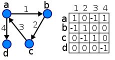
- **matice sousednosti**
	- čtvercová matice dle počtu vrcholů
	- řádky i sloupce odpovídají vrcholům
	- tam kde jsou vrcholy spojené je nenulové číslo (váha)
	- 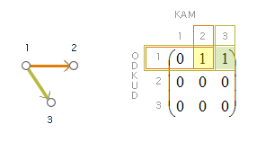

### Průchod grafem z vrcholu u do v

- **sled**
 	- libovolná posloupnost vrcholů a hran (jak se po sobě navazujících hranách dostat z u do v)
 	- pokud u=v -> uzavřený sled
- **tah**
 	- je sled, kde se nesmí opakovat hrany
 	- pokud u=v -> uzavřený tah
- **cesta**
 	- je tah, kde se nesmí opakovat vrcholy
 	- pokud u=v -> **kružnice** (uzavřená cesta)

### Operace s grafem

- **kontrakce hrany** - vrcholy spojené danou hranou se spojí(merge-nou) v jeden, daná hrana zanikne
- **odstranění hrany** - hrana je odstraněna z množiny hran, vše ostatní zůstává
- **odstranení vrholu** - odstraní se vrchol a všechny hrany s ním spojené
- **dělení hrany** - hrana se rozdělí na 2 hrany s jedním vrcholem uprostřed

### Další důležité pojmy

**PodGraf** - graf vzniklý odebráním vrcholů či hran z původního grafu

**Faktor grafu** - podgraf obsahující všechny vrcholy původního grafu

**Acyklický graf (les)** - graf, ve kterém neexistuje kružnice

**Souvislý graf** - je takový, který má právě 1 komponentu (mezi libovolnou dvojici vrcholů existuje u-v sled)

**Komponenta grafu** - maximální souvislý podgraf

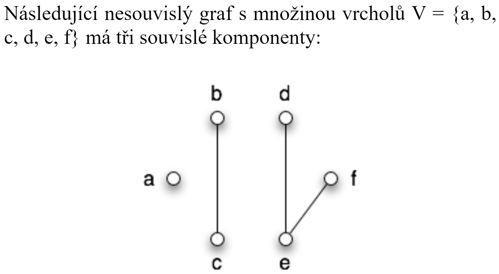

_komponenty_

**Strom** 
- souvislý acyklický graf, kde ekvivaletně platí:
	- G je strom
	- G je acyklický a zároveň |V| = |H| + 1
	- G je souvislý a zároveň |V| = |H| + 1
	- Mezi libovolnými vrcholy existuje právě jedna cesta
- Z definice stromu vyplývá, že mezi každými dvěma vrcholy existuje právě jedna cesta (alespoň jedna cesta, protože je souvislý; nemůže nastat situace více cest, protože díky neexistenci kružnice není možné zvolit "objížďku").
- 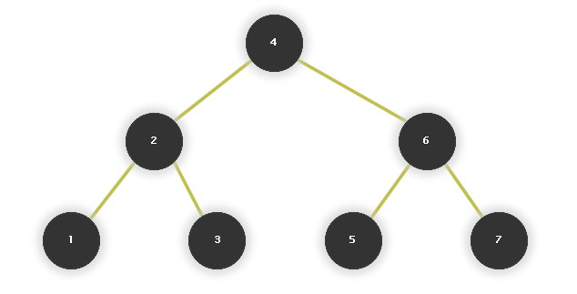

**Kostra grafu** 
 - takový podgraf souvislého grafu G na množině všech jeho vrcholů, který je stromem (strom, obsahující všechny vrcholy grafu G)
 - Pokud původní graf (graf, ke kterému hledáme kostru) obsahuje kružnici, pak máme více možností, jak kostru zvolit.
 - 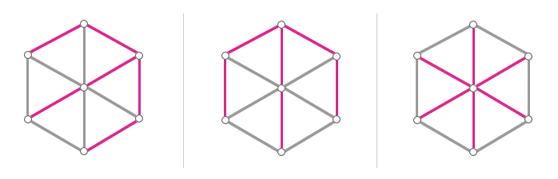

**Isomorfní graf** 
 - graf který vznikne přeznačením vrcholů (bijektivní zobrazení vrcholů starého grafu do vrcholů nového grafu)
 - 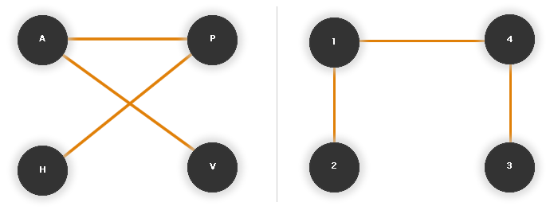
 
**Úplný graf** 
 - Úplný graf je takový graf, ve kterém jsou každé dva vrcholy spojené hranou.
 - 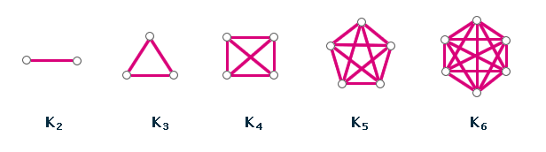

**Stupeň vrcholu**
- značíme deg(u)
- *Neorientovaný graf*
  - počet hran, které do daného vrcholu zasahují
  - případné smyčky počítáme dvakrát
- *Orientovaný graf* 
  - rozlišujeme deg+(u) a deg-(u)
  - deg+(u) počet vstupních hran vrcholu u
  - deg-(u) počet výstupních hran vrcholu u
  - celkový stupeň uzlu je roven součtu vstupujících a vystupujících hran
 - 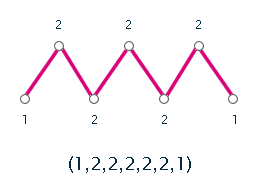

**Skóre grafu** 
- posloupnost stupňů vrcholů grafu G seřazená nerostoucím způsobem
- Dvě skóre považujeme za stejná, pokud jedno můžeme dostat z druhého přerovnáním čísel (permutací).
- Pokud dva grafy mají různé skóre, nejsou isomorfní.
- Neplatí ale opak tohoto tvrzení (stejné skóre → isomorfní grafy). Příklad, který by takovéto tvrzení nesplnil, je na obr. č. 2.17 – zkuste si rozmyslet, proč grafy nejsou isomorfní, ačkoliv mají stejné skóre.
	- 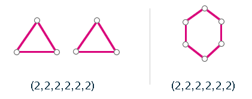

## Eulerovský graf

- tzv. "jednotažky", lze je nakreslit jedním tahem
- je souvislý graf G, kde existuje **Eulerův tah** (je jedno jestli otevřený nebo uzavřený)

**Eulerovský tah**

- takový u-v tah, který obsahuje každou hranu právě jednou
- otevřený u != v (je definován stejně jako tah uzavřený, pouze se nevrací do původního bodu, kde začal.)
- uzavřený u=v (**eulerovská kružnice**) (vrací se do počátečního bodu)

**Kritérium eulerovskosti**

- souvislý graf je eulerovský práve tehdy, když má všechny vrcholy sudého stupně, nebo právě 2 vrcholy lichého
- pokud má všechny sudé, tak existuje eulerovská kružnice
- pokád má 2 liché, tak existuje neuzavřený eul. tah, který začíná v libovolném 1 z vrcholů lichého stupně a končí v tom druhém

## Hamiltonovský grafy
- je souvislý graf, ve kterém existuje **Hamiltonovská kružnice**.
- Hamiltonovský graf je graf, který lze projít takovou cestou, že každý jeho uzel je navštíven právě jednou s výjimkou uzlu výchozího, který je zároveň uzlem cílovým. Neboli - graf je hamiltonovský, právě když obsahuje kružnici, která prochází všemi jeho uzly (tzv. hamiltonovská kružnice).

**Hamiltonovská kružnice** - kružnice, která je *faktorem* (podgraf, který obsahuje všechny původní vrcholy)

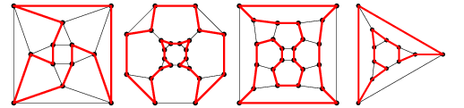

**Problém obchodního cestujícího**

- Máme úplný, ohodnocený graf
- hledáme hamiltonovskou kružnici nejmenší možné váhy

## Rovinné grafy

- jsou grafy, u kterých existuje rovinné nakreslení, tj. nakreslení bez křížení hran
- 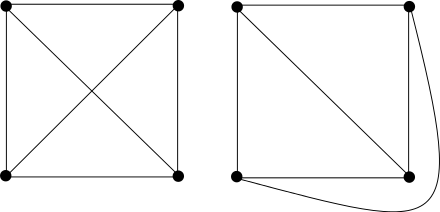

## Prohledávání grafu
Chceme projít všechny vrcholy grafu.

### Do hloubky (DFS - LIFO)
- Depth-first search
- algoritmus vezme první hranu (obvykle nejlevnější), dostane se k dalšímu vrcholu
- tam opět vezme první hranu a takto postupuje dokud nenarazí na vrchol, který nemá další hranu, nebo na konečný vrchol
- v tu chvíli se vrátí na předchozí vrchol a jde druhou hranou
- při procházení do hloubky se využívá zásobník (LIFO)
- [YouTube](https://www.youtube.com/watch?v=iaBEKo5sM7w)
- [YouTube](https://www.youtube.com/watch?v=pcKY4hjDrxk)
- 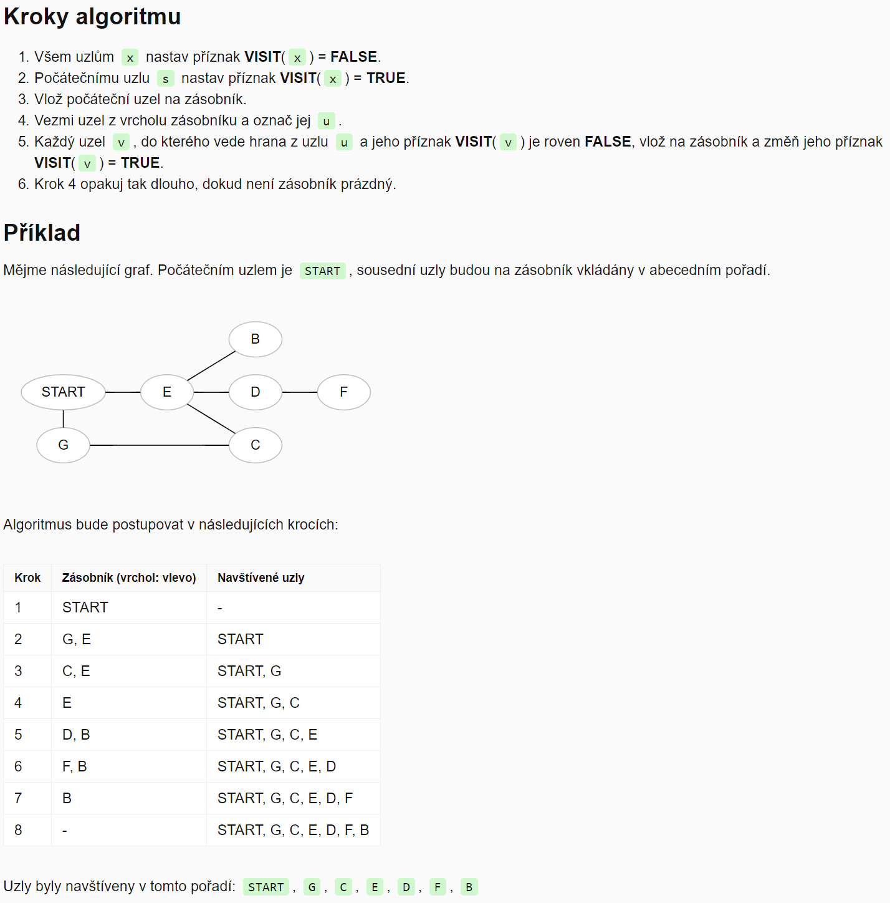

### Do šířky (BFS - FIFO)
- Breadth-first search
- algoritmus nejprve vyčerpá všechny dostupné hrany a až pak se přesune na další vrchol  
- při procházení do šířky se využívá fronta (FIFO)
- veškeří následovníci uzlu získaní expandujícím uzlem jsou vkládani do FIFO fronty
- [YouTube](https://www.youtube.com/watch?v=QRq6p9s8NVg)
- [YouTube](https://www.youtube.com/watch?v=pcKY4hjDrxk)

## Minimální kostra

Minimální kostra je kostra s nejmenší možnou váhou.

**Jarníkův - Primův**

- algoritmus vychází z libovolného uzlu a udržuje si seznam již objevených uzlů a jejich vzdáleností od propojené části grafu
- vkaždém svém kroku připojí ten z uzlů, mezi nímž a projenou částí grafu je hrana nejnižší délky
- označí sousedy nově připojeného uzlu za objevené, případně zkrátí vzdálenosti od již známých uzlů, pokud byla nalezena výhodnější hrana
- v okamžiku, kdy jsou propojeny všechny uzly, algoritmus terminuje.
- [YouTube](https://www.youtube.com/watch?v=cplfcGZmX7I)

**Borůvkův algoritmus**

- princip skládání komponent
- na začátku všechny vrcholu jako samostatné komponenty
- algoritmus je pak postupně propojuje pomocí nejlevnějších hran
- zastaví se jakmile dosáhne jedné komponenty

**Kruskalův algoritmus**
- [YouTube](https://www.youtube.com/watch?v=71UQH7Pr9kU)

## Nejkratší cesta

Hledání nejkratší cesty z vrcholu u do vrcholu v.

**Dijkstrův algoritmus**

- počáteční vrchol má skóre 0 a všechny ostatní nekonečno
- každý následující vrchol dostane skóre součtem skóre vrcholu a váhy hrany, kterou jsou spojené
- pokud se do daného vrcholu lze dostat více hranami, tak výsledné skóre tohoto vrcholu je to menší
- výsledná cesta je pak cesta přes vrcholy s nejmenším skóre
- [YouTube](https://www.youtube.com/watch?v=_lHSawdgXpI)

