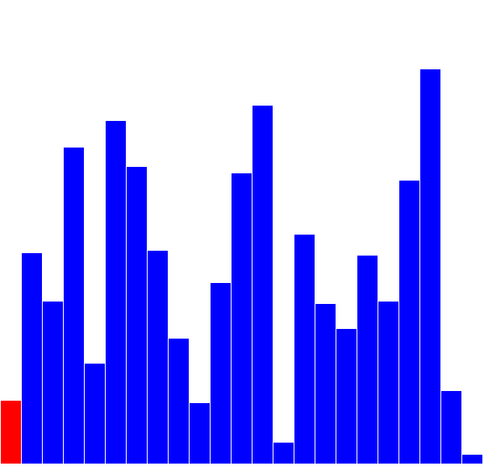

# 6. Problematika řazení

> Problematika řazení – základní algoritmy a jejich složitost.

## Formální definice

 ... abeceda, nad kterou je dáno řazení

 ... posloupnost (slovo) nad abecedou 

Cílem je nalézt permutaci  takovou, že posloupnost  je setříděná, tj. 

## Vlastnosti

- *na místě* - pro řazení se nepoužívá žádná další datová struktura (např. další pole)
- *stabilní* - v seřazené posloupnosti je zachováno pořadí rovnocenných prvků
- *přirozený* - rychleji zpracuje (částečně) seřazenou množinu, u nepřirozeného to nehraje roli
- [*interní*](https://en.wikipedia.org/wiki/Internal_sort) - všechna data jsou k dispozici v paměti
- [*externí*](https://en.wikipedia.org/wiki/External_sorting) - další prvky přichází v průběhu řazení
- složitost 
 - [*časová složitost*](https://cs.wikipedia.org/wiki/Asymptotick%C3%A1_slo%C5%BEitost) (dále jako ) viz okruh [7 - Časová náročnost algoritmů](https://github.com/tomaskrizek/tul-szz-it-nv/blob/master/07_casova_narocnost_algoritmu/07_casova_narocnost_algoritmu.md)
 - *paměťová složitost*

## Rozlišujeme

a. Postupné rozšiřování setříděné části
- Selection sort 
- Insertion sort 

b. Záměnu dvojic po sobě jdoucích prvků
- Bubble sort 
- Sinking sort 
- Shaker 

c. Divide and Conquer
- Merge sort 
- Quick sort 

| Anglicky       | Česky             | Nejlepší   | Průměrně   | Nejhorší   | Dodatečná pamět | Stabilní  | Přirozené | Metoda    |
|----------------|-------------------|------------|------------|------------|-----------------|-----------|-----------|-----------|
| Selection sort | Řazení výběrem    | O(n²)      | O(n²)      | O(n²)      | O(1)            | zprav. ne | ne        | výběr     |
| Insertion sort | Řazení vkládáním  | O(n)       | O(n²)      | O(n²)      | O(1)            | ano       | ano       | vkládání  |
| Bubble sort    | Bublinkové řazení | O(n)       | O(n²)      | O(n²)      | O(1)            | ano       | ano       | záměna    |
| Merge sort     | Řazení slučováním | O(n log n) | O(n log n) | O(n log n) | O(log n)        | ano       | ne       | slučování |
| Quicksort      | Rychlé řazení     | O(n log n) | O(n log n) | O(n²)      | O(log n)        | ne        | ne        | záměna    |

## a) Rozšiřování setříděné části

### Selection Sort

V každém kroku vybere z nesetříděné části nejmenší prvek a vloží nakonec setříděné části.
Není stabilní jelikož dochazí k prohazování prvků, a tudíž se mohou stejné hodnoty v poli přeházet.

### Insertion Sort

Vyberu první prvek z nesetříděné části a zařadím ho na správné místo v setříděné části.

v nejhorším případě ... 

pro téměř seřazenou posloupnost ... 

## b) Záměna dvojic mimo pořadí

### Bubble Sort

Nesetříděnou posloupnost procházím shora dolů a porovnávám dvojice po sobě jdoucích prvků; dvojice mimo pořadí zaměním. Tím se na přední pozici dostane vždy nejmenší prvek.

### Sinking Sort

For example, in Donald Knuth's The Art of Computer Programming, Volume 3: Sorting and Searching he states in section 5.2.1 'Sorting by Insertion', that [the value] "settles to its proper level" and that this method of sorting has sometimes been called the sifting or sinking technique.[clarification needed]

This debate is perpetuated by the ease with which one may consider this algorithm from two different but equally valid perspectives:

The larger values might be regarded as heavier and therefore be seen to progressively sink to the bottom of the list
The smaller values might be regarded as lighter and therefore be seen to progressively bubble up to the top of the list.

### Shaker Sort

Kombinace Bubble Sort a Sinking Sort. Střídá se procházecí pořadí.

## c) Divide and conquer

### Merge sort

Vstupní posloupnost se rekurzivně dělí na dvě poloviny až jsou poslopnosti délky jedna. Následuje zpětný chod, tj. sestavení setříděné posloupnosti. Při zpětném chodu se sloučí dvě fronty do jedné (nejmenší prvek je vždy na začátku jedné ze dvou front).

### Quick sort

Zvolíme tzv. pivota a posloupnost rozdělíme na dvě části. Jedna z nich obsahuje prvky menší nebo rovny pivotu a druhá obsahuje prvky větší než pivot. Na tyto dvě posloupnosti se rekurzivně aplikuje stejná operace.

složitost v nejhorším případě ... 

průměrná složitost ... 
