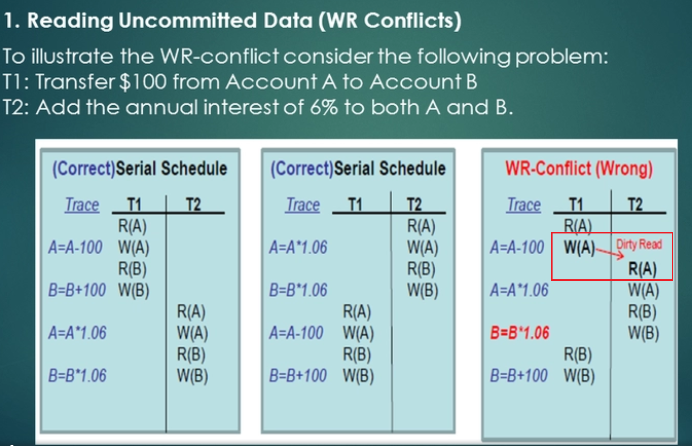
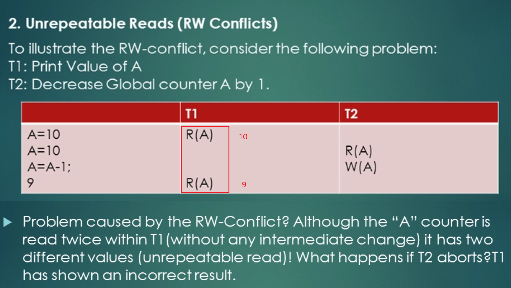
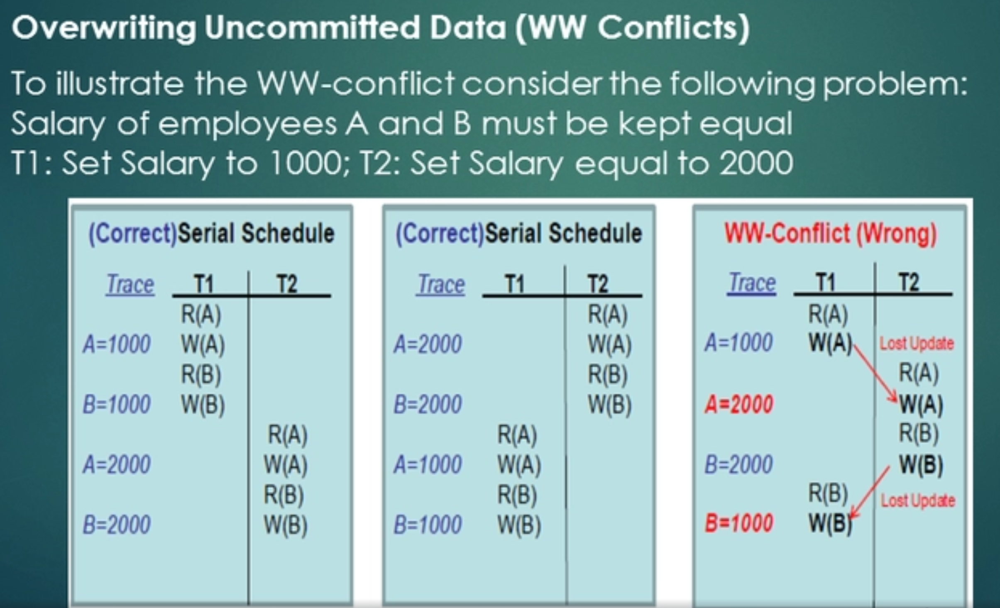

# 16. - Jazyk SQL

> Jazyk SQL (DDL, DML, množinové operace), uložené procedury a spouště v SQL, transakce (ACID, typy konfliktů, stupně izolace).

## Jazyk SQL
**SQL** = Structured Query Language; standardizovaný strukturovaný dotazovací jazyk, který je používán pro práci s daty v relačních databázích; založen na relačním kalkulu a relační algebře.

SQL příkazy se dělí na čtyři základní skupiny:
- **DML** (data manipulation language) - příkazy pro manipulaci s daty (SELECT, INSERT, UPDATE, DELETE, ...),
- **DDL** (data definition language) - příkazy pro definici dat (CREATE, ALTER, DROP, ...),
- **DCL** (data control language) - příkazy pro řízení přístupových práv (GRANT, REVOKE),
- příkazy pro řízení transakcí (START TRANSACTION, COMMIT, ROLLBACK).

### Typy dat v SQL (SQL92)
**Numerické typy** - INTEGER, SMALLINT, NUMERIC, DECIMAL, FLOAT, REAL, DOUBLE  PRECISION

**Znakové řetězce** - CHARACTER (CHAR), CHARACTER VARYING (VARCHAR)

**Temporální data** - DATE (rrrr-mm-dd)

**Integritní omezení** - NOT NULL, DEFAULT, UNIQUE, PRIMARY KEY, FOREIGN KEY, CHECK

### DML / SELECT
Základním konstruktem pro výběr dat je **SELECT**-**FROM**-**WHERE** blok. Klauzule **SELECT** obsahuje seznam sloupců vytvářejících schéma tabulky. Klauzule **FROM** obsahuje seznam tabulek, nad kterými je dotaz definován a klauzule **WHERE** obsahuje podmínku, kterou musí splňovat vyhledávaná data. **Select** neeliminuje z výsledku duplicitní hodnoty (k tomu slouží další operátory).

#### Základní pojmy a klíčová slova
**Agregační funkce**: SUM, AVG, MIN, MAX, COUNT

**Predikáty**: IN, ANY, ALL, SOME, EXISTS

**Poddotaz**: můžeme užít i s porovnávacími operátory, máme-li zaručeno, že výsledkem poddotazu je právě jedna hodnota

**GROUP BY**: tabulka se konceptuálně rozdělí na skupiny, pro které je hodnota zvoleného sloupce konstantní; řádky obsahující v tomto sloupci hodnotu NULL se seskupí do jedné skupiny; získáváme tzv. seskupenou tabulku; každá skupina přispívá do výsledné tabulky **jedním** řádkem; je syntaktická konstrukce jazyka SQL pro agregaci záznamů vybíraných pomocí příkazu SELECT

**HAVING**: je velmi podobná podmínce WHERE; rozdíl je v tom, že podmínka WHERE omezuje ještě neseskupené záznamy a podmínka HAVING omezuje seskupené záznamy

**LIKE**: podmínka za klíčovým slovem WHERE a slouží k vyhledání záznamů obsahujících určité výrazy; procento nahrazuje libovolný počet znaků; podtržítko zastupuje jeden libovolný znak

**EXISTS**: je test na neprázdnost množiny

**DISTINCT**: z výpisu odstraní záznamy, které se v dané hodnotě pole opakují

**UNION, INTERSECT, EXCEPT**: množinové operace; tabulky musejí být kompatibilní (stejný počet sloupců, stejný typy dat odpovídajících si sloupců)

#### Spojení tabulek
**přirozené spojení**
``` sql
SELECT * FROM R NATURAL JOIN S;
```
**spojení křížem (kartézský součin)**
``` sql
SELECT * FROM R CROSS JOIN S;
```
**spojení přes podmínku**
``` sql
SELECT * FROM R JOIN S ON A > B;
```
**spojení přes vyjmenované sloupce**
``` sql
SELECT * FROM R JOIN S USING (A, B);
```
**vnitřní vs. vnější spojení**
Vnější spojení slouží k přidání některých řádků, které se s ničím nespojily, do výsledku.
``` sql
SELECT * FROM R INNER(LEFT, RIGHT) JOIN S USING (A, B);
```

#### Příklady

*Názvy kin*
``` sql
SELECT nazev_k
FROM Kina;
```
*Názvy kin bez duplicity*
``` sql
SELECT DISTINCT nazev_k
FROM Kina;
```
*Dvojice jaké filmy, které kino promítá?*
``` sql
SELECT DISTINCT k_filmu, k_kina 
FROM Program
ORDER BY k_filmu ASC;
```
*Všechny informace o promítáních po 5.4.2002*
``` sql
SELECT *
FROM Program
WHERE datum_prom > '5.4.2002';
```
*Všechny informace o promítáních od 1.4.2002 do 5.4.2002*
``` sql
SELECT *
FROM Program
WHERE datum BETWEEN ‘1.4.2002’ AND ‘5.4.2002’;
```
*Názvy filmů, které jsou promítány*
``` sql
SELECT DISTINCT nazev_f 
FROM Filmy, Program
WHERE Filmy.k_filmu = Program.k_filmu;
```
*Dvojice filmů se stejným režisérem?*
``` sql
SELECT X.k_filmu AS První, Y.k_filmu AS Druhý
FROM Filmy X, Filmy Y
WHERE X.reziser = Y.reziser AND X.k_filmu <> Y.k_filmu;
```
*Jaké budou ceny promítání při navýšení o 20%?*
``` sql
SELECT k_kina, k_filmu, cena*1.2 
FROM Promítání;
```
*Pro kino Blaník kódy filmů, které promítá a cenu promítání v eurech.*
``` sql
SELECT k_filmu, cena/31.2 
FROM Promítání X, Kina Y
WHERE X.k_kina = Y.k_kina AND X.nazev_k = ‘Blaník’;
```
*Počet kin*
``` sql
SELECT COUNT (*) AS počet_kin
FROM Kina;
```
*Kolik je promítáno filmů?*
``` sql
SELECT COUNT (DISTINCT k_filmu) AS počet_promítaných_filmů
FROM Promítání;
```
*Počet kin s kapacitou větší než 200*
``` sql
SELECT COUNT (*) AS počet_kin_s_kapacitou
FROM Kina
WHERE kapacita > 200;
```
*Jaká je průměrná cena za vstupenku na film Apollo 13?*
``` sql
SELECT AVG(Cena) AS průměrná_cena
FROM Promítání X, Filmy Y
WHERE X.k_filmu = Y.k_filmu AND Y.nazev_f = ‘Apollo 13’;
```
*Kolik filmů natočili jednotliví režiséři?*
``` sql
SELECT reziser, COUNT(k_filmu)
FROM Filmy
GROUP BY reziser;
```
*Kteří režiséři natočili alespoň tři filmy?*
``` sql
SELECT reziser
FROM Filmy
GROUP BY reziser 
HAVING COUNT(k_filmu) > 2;
```
*Jaká je průměrná cena vstupenek u jednotlivých filmů?*
``` sql
SELECT X.k_filmu, nazev_f, AVG(Cena)
FROM Filmy X, Promítání Y
WHERE X.k_filmu = Y.k_filmu
GROUP BY k_filmu;
```
*Hodnoty sloupce nazev_f  libovolné délky začínající na PS*
``` sql
nazev_f  LIKE ‘PS%’ 
```
*Adresy kin obsahující slovo Praha*
``` sql
adresa  LIKE ‘%Praha%’
```
*Adresy kin, ve kterých dávají film s kódem 6524*
``` sql
SELECT Adresa FROM Kina
WHERE k_kina IN (SELECT  k_kina  FROM Promítání WHERE k_filmu = ‘6524’);
```
*Adresy kin, ve kterých dávají film Gladiátor natočený roku 2000*
``` sql
SELECT Adresa FROM Kina
WHERE k_kina IN 
	(SELECT k_kina FROM Promítání P	WHERE P.k_filmu = 
		(SELECT F.k_filmu FROM Filmy F WHERE F.nazev_f = „Gladiátor“ AND rok_v = 2000));
```
*Jména filmů, kteří se v některém kině promítají.*
``` sql
SELECT nazev_f FROM Filmy F
WHERE EXISTS (SELECT * FROM Promítání
	WHERE k_filmu = F.k_filmu);
```
*Filmy, které natočil režisér Hřebejk nebo jsou promítány 2.4.2002*
``` sql
(SELECT k_filmu FROM Filmy 
WHERE reziser = ‘Hřebejk’)
UNION
(SELECT k_filmu FROM Promítání
WHERE datum = ‘2.4.2002’);
```

### DML / CRUD bez R
*Příklad na vložení záznamu*
``` sql
INSERT INTO example (field1, field2, field3) VALUES ('test', 'N', NULL);
```
*Příklad na aktualizaci záznamu*
``` sql
UPDATE example SET field1 = 'updated value' WHERE field2 = 'N';
```
*Příklad na smazání záznamu*
``` sql
DELETE FROM example WHERE field2 = 'N';
```
### DDL
*Příklad na vytvoření entity*
``` sql
CREATE TABLE example(
 column1 INTEGER,
 column2 VARCHAR(50),
 column3 DATE NOT NULL,
 PRIMARY KEY (column1, column2)
);
```
*Příklad na změnu definice entity*
``` sql
ALTER TABLE example ADD column4 NUMBER(3) NOT NULL;
```
*Příklad na odstranění entity*
``` sql
DROP TABLE example;
```

## Uložené procedury a spouště (od SQL3)
**Trigger** (= spoušť) je procedura, která je automaticky spuštěna jako reakce na specifikovanou akci v databázi; trigger se vykoná, pokud nějakou hodnotu ve sloupci budeme přidávat, nebo modifikovat a nebo mazat; u všech tří akcí můžeme specifikovat, zdali se trigger vyvolá před vlastním příkazem, nebo až po vlastním příkazu >> **before triggery** a **after triggery**; lze kombinovat akce, při kterých se má trigger spustit - trigger reagující na UPDATE nebo DELETE 

*Příklad triggeru - automaticky odstranit záznam pracovníka, jehož záznam v tabulce LIDÉ mažeme*
``` sql
CREATE TRIGGER aktualizuj_platy
ON lidé
FOR DELETE
AS 
	DELETE FROM platy
	WHERE platy.osoba_id = lidé.id 
```

**Uložená procedura**  je databázový objekt, který neobsahuje data, ale část programu, který se nad daty v databázi má vykonávat. Lze se k ní chovat stejně jako ke každému jinému objektu databáze (založit, upravovat a smazat) pomocí příkazů dotazovacího jazyka databáze. Uložené procedury jsou vykonávány přímo databázovým serverem. Je to vlastně jakýsi skript - přesněji řečeno dávka - která je uložena přímo v databázi. Procedury mohou obsahovat vstupní parametry, výstupní parametry a návratové hodnoty.

*Příklad uložené procedury - vytvoření procedury vracející string a její následné volání*
``` sql
CREATE PROCEDURE my_hello_world
AS
	SELECT 'Hello, World!';
GO

my_hello_world;
```
## Pohledy
**Pohledy** (views) = virtuální tabulky. Slouží především pro dotazování. Umožňují značné zjednodušení zápisu dotazů (obdobně jako rozčlenění programu do procedur).

``` sql
CREATE VIEW Prazaci
AS 
	SELECT k_zamestnance, jmeno_z FROM Zamestnanci
	WHERE Adresa LIKE ‘%Praha%’;

SELECT k_zamestnance FROM Prazaci 
WHERE Plat > 10000;

DROP VIEW Prazaci;
```

## Transakce
**transakce** = je série příkazů čtení či zápisu na databázových objektech; základní vlastností transakce je ACID

- čtení - db objekt se přenese do paměti z HDD a následně je pak do proměnné programu
- zápis - db objekt je modifikován v paměti a následně zapsán na disk
- db objekt - jednotky se kterými pracují programy

*Příklad transakce*
``` sql
START TRANSACTION;
 UPDATE Account SET amount=amount-200 WHERE account_number=1234;
 UPDATE Account SET amount=amount+200 WHERE account_number=2345;

IF ERRORS=0 COMMIT;
IF ERRORS<>0 ROLLBACK;
```

### ACID
- **Atomicity** 
  - buď proběhnout všechny operace transakce nebo neproběhnou žádné; uživatel se nemusí starat o výsledek nekompletní transakce
  - Databázová transakce je jako operace dále nedělitelná (atomární). Provede se buď jako celek, nebo se neprovede vůbec (a daný databázový systém to dá uživateli na vědomí, např. chybovým hlášením)
- **Consistency** 
  - transakce musí zachovávat konzistentní stav databáze; při spuštění transakce v db, která je v konzistentním stavu, ji tato transakce musí po svém ukončení opustit v konzistentním stavu; konzistenci musí zaručit uživatel; SŘBD se stará o to, aby to platilo i u paralelně pobíhajících transakcí
  - Při a po provedení transakce není porušeno žádné integritní omezení.
- **Isolation** 
  - v případě že v systému probíhá více transakcí paralelně, SŘBD zaručí, že transakce jsou izolované jedna od druhé, tedy že jedna nebude ovlivňovat druhou; pro uživatele to znamená, že pro něj DB vypadá jako, že aktuálně probíhá pouze jedna (jeho) transakce
  - Operace uvnitř transakce jsou skryty před vnějšími operacemi. Vrácením transakce (operací ROLLBACK) není zasažena jiná transakce, a když ano, i tato musí být vrácena. V důsledku tohoto chování může dojít k tzv. řetězovému vrácení (angl. cascading rollback).
- **Durability** 
  - pokud byla transakce jednou dokončena a potvrzena, pak SŘBD zaručí, že všechny změny provedené transakcemi zůstanou zachovány v db i při případném selhání systému
  - Změny, které se provedou jako výsledek úspěšných transakcí, jsou skutečně uloženy v databázi, a již nemohou být ztraceny.

### Typy konfliktů
- **WR konflikt** 
  - čtení dat, která nebyla potvrzena (commit)
  - 
- **RW konflikt**
  - neopakovatelné čtení dat; čteme 2x, ale po prvním čtení se data změní = výsledkem jsou dvě rozdílné sady dat
  - 
- **WW konflikt**
  - přepsání nepotvrzených dat
  - 

K eliminaci konfliktů se používá *přidělování sdílených zámků - 2PL a Strict 2PL*. Je třeba zaručit, že příkazy lock a unlock budou atomické operace - semafory.

**Strict 2PL**

Pravidla pro přidělování zámků transakcím:

1. Pokud chce transakce číst (modifikovat) objekt db, musí nejprve požádat o sdílený (exklusivní) zámek.
2. Všechny zámky držené transakcí jsou uvolněny po jejím skončení.

**2PL**

1. Pokud transakce chce číst (modifikovat) objekt db, nejprve musí požádat o sdílený (exklusivní) zámek.
2. Transakce nemůže požádat o nový zámek, pokud již nějaký neuvolnila.

### Stupně izolace
- **READ UNCOMMITTED** - čtení záznamů, které ještě nejsou potvrzeny (commit); nevyužívají zámky a tím nedokážou zabránit jiné transakci v modifikaci dat které zrovna čte současná transakce; označují se také jako "dirty reads"
- **READ COMMITTED** - čtení záznamů, které byly potvrzeny (commit); vylepšení oproti předchozímu "dirty reads"
- **REPEATABLE READ** - čtení záznamů, které byly potvrzeny (commit) a zároveň jsou čtené záznamy zablokovány proti dalším modifikacím do skončení čtecí transakce 
- **SERIALIZABLE** - čtení záznamů, které byly potvrzeny (commit) a zároveň jsou čtené záznamy zablokovány proti dalším modifikacím do skončení čtecí transakce; zároveň jiné transakce nemohou vkládat data, která by mohla ovlivnit současné čtení (že by se nově vkládaná data mohla objevit ve čtecí transakci); jedná se o nejvíce restriktivní stupeň izolace

**Příklad Dirty Reads**

Dirty read nastává, pokud transakce čte data, která byla modifikována jinou transakcí, která není potvrzena. Transakce B vidí data, která jsou upravena transakcí A. Tyto změny však nejsou potvrzeny.
