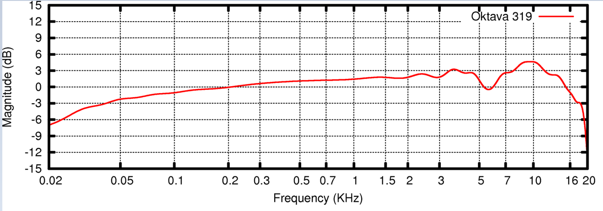

# 21. - LTI číslicové systémy

> Vlastnosti (linearita, kauzalita, stabilita), impulsní odezva (FIR/IIR), 
frekvenční charakteristika, přenosová funkce, skupinové zpoždění, lineární diferenční rovnice 
s konstantními koeficienty, systém s lineární a minimální fází. 

**Systém** dokáže generovat, zpracovávat, modifikovat a přijímat signály. Signál je projevem činnosti systému.

Příklady:
- Hudební nástroj - lze považovat za systém generující zvuk
- Zesilovač, ekvalizér - systém, který modifikuje zvukový signál
- A/D a D/A převodník - transformují jeden typ signálu na jiný
- Reproduktor - převádí elektrický signál na akustický, atd.

**LTI (Linear Time Invariant)** systémy jsou takové systémy, které jsou lineární a časově nezávislé.

## Vlastnosti

### Linearita

Lineární systém je aditivní a homogenní

##### Aditivita (Additivity)

![T (x1[n] + x2[n]) = T (x1[n]) + T (x2[n])](https://latex.codecogs.com/svg.latex?T%28x_%7B1%7D%5Bn%5D%20&plus;%20x_%7B2%7D%5Bn%5D%29%20%3D%20T%28x_%7B1%7D%5Bn%5D%29%20&plus;%20T%28x_%7B2%7D%5Bn%5D%29)

##### Homogenita (Homogenity)

![T (cx[n]) = cT (x[n])](https://latex.codecogs.com/svg.latex?T%20%28cx%5Bn%5D%29%20%3D%20cT%20%28x%5Bn%5D%29)

**Pro linearitu tedy platí podmínka**

- výstup systému pro lineární kombinaci budících signálů je roven lineární kombinaci výstupů na jednotlivé budící signály

- z linearity vyplývá princip superpozice (výstup systému lze složit z výstupu na dílčí buzení)

**Příklad lineárního systému**

**Příklad nelineárního systému**

### Kauzalita

Výstup kauzálního systému závisí pouze na současných a minulých hodnotách

- Kauzální systém : 
- Nekauzální systém : 
- LTI systémy jsou kauzální poouze v případě, že h[n] = 0 pro n < 0

### Stabilita

- Pokud je vstup do systému omezený (např. na interval <-1;1>) tak jeho výstup bude také omezený (tzn. jeho rozsah se nebude rozpínat do nekonečna)
- Obecně lze říct že systém je stabilní, pokud amplituda jeho výstupu neroste nad všechny meze. (Nestabilní systém je např. s kladnou zpětnou vazbou)
- LTI szstémy jsou stabilní pouze v případě, že 

### Invariantnost vůči (časovému) posunu

- Nechť ![y[n]](https://latex.codecogs.com/svg.latex?y%5Bn%5D) je výstup systému  na ![x[n]](https://latex.codecogs.com/svg.latex?x%5Bn%5D) 
- Pak  je invariantní vůči posunu, pokud pro libovolné zpoždění  platí, že odezva na  je 

### Popis LTI systému

lze popsat pomocí:

- Impulzní odezva
	- výčtem prvků: ![h[n] = [2,-1]](https://latex.codecogs.com/svg.latex?h%5Bn%5D%20%3D%20%5B2%2C-1%5D)
- Diferenční rovnicí: ![y[n] = 2\delta[n] - \delta[n-1]](https://latex.codecogs.com/svg.latex?y%5Bn%5D%20%3D%202%5Cdelta%5Bn%5D%20-%20%5Cdelta%5Bn-1%5D)
- Frekvenční charakteristika
	- 
- Přenosová funkce
	- 

## Impulsní odezva (FIR/IIR)

- je výstup LTI systémů na tzv. jednotkový impulz (značen písmenem )
- značí se ![h[n]](https://latex.codecogs.com/svg.latex?h%5Bn%5D)

### Konvoluce

Vyjadřuje vztah mezi vstupem a výstupem LTI systému
daného impulsní odezvou

![y[n] = x[n] * h[n] = \sum_{k=0}^{N-1}x[k]\cdot h[n-k]](https://latex.codecogs.com/svg.latex?y%5Bn%5D%20%3D%20x%5Bn%5D%20*%20h%5Bn%5D%20%3D%20%5Csum_%7Bk%3D0%7D%5E%7BN-1%7Dx%5Bk%5D%5Ccdot%20h%5Bn-k%5D)

### FIR (Finite Impulse Response)

- jsou systémy s konečnou impulzní odezvou
- bez zpětné vazby
- např. ![y[n] = x[n] + x[n - 1]](https://latex.codecogs.com/svg.latex?y%5Bn%5D%20%3D%20x%5Bn%5D%20&plus;%20x%5Bn%20-%201%5D)

### IIR (Infinite Impulse Response)

- jsou systémy s nekonečnou impulzní odezvou
- obsahují zpětnou vazbu
- např. ![y[n] = x[n] + 0,5y[n - 2]](https://latex.codecogs.com/svg.latex?y%5Bn%5D%20%3D%20x%5Bn%5D%20&plus;%200%2C5y%5Bn%20-%202%5D)

## Frekvenční charakteristika

Funkci, která popisuje závislost vlastních hodnot na frekvenci ω značíme 

Získáme ji aplikací DTFT na impulzní odezvu systému ![h[n]](https://latex.codecogs.com/svg.latex?h%5Bn%5D)

Obvykle se uvádí ve formě dvou reálných funkcí:

- magnitudová charakteristika 
- fázová charakteristika 

Dohromady: 

## Skupinové spoždění

- Místo fázové charakteristiky (u filtrů s lineární fázovou charakteristikou) se často uvádí skupinové zpoždění
- Udává zpoždění úzkopásmového signálu složeného ze skupiny harmonitckých komponent v okolí frekvence ω po průchodu LTI systémem (ve vzorcích)
-  

## Přenosová funkce

- Získáme ji pomocí Z-transformace impulsní odezvy

### Z-transformace

- Z-transformace diskrétní řady ![x[n]](https://latex.codecogs.com/svg.latex?x%5Bn%5D) je definována jako:
	- ![X(z) = \sum_{n = 0}^{N-1} x[n] \cdot z^{-n}](https://latex.codecogs.com/svg.latex?X%28z%29%20%3D%20%5Csum_%7Bn%20%3D%200%7D%5E%7BN-1%7D%20x%5Bn%5D%20%5Ccdot%20z%5E%7B-n%7D)
- Z-obraz je komplexní funkce komplexní proměnné. Jeho vlastnosti se nejčastěji popisují v z-rovině
- DTFT ze Z-obrazu získáme dosazením , tedy DTFT je tvořena body na jednotkové kružnici v Z rovině

#### Přenosová funkce

-  jsou koeficienty vstupu a  jsou koeficienty zpětné vazby
- Příklad: 
	- ![y[n] - 5y[n-3] = 2x[n] - 3x[n-1]](https://latex.codecogs.com/svg.latex?y%5Bn%5D%20-%205y%5Bn-3%5D%20%3D%202x%5Bn%5D%20-%203x%5Bn-1%5D)
	- 
  
- Přenosová funkce je velmi důležitá z hlediska analýzy systémů (stabilita, kauzalita, systémy s lineární fází, minimální fází apod.)

## Lineární diferenční rovnice s konstantními koeficienty

- Linear constant coefficient difference equation (LCCDE)
- Speciální případ diferenčních rovnic popisující LTI systémy

![y[n] = \sum_{k=0}^{q}b[k]x[n-k] - \sum_{k=1}^{p}a[k]y[n-k]](https://latex.codecogs.com/svg.latex?y%5Bn%5D%20%3D%20%5Csum_%7Bk%3D0%7D%5E%7Bq%7Db%5Bk%5Dx%5Bn-k%5D%20-%20%5Csum_%7Bk%3D1%7D%5E%7Bp%7Da%5Bk%5Dy%5Bn-k%5D)

- Vztah rekurzivně definující výstup ze systému jako lineární kombinaci hodnot vstupu a minulých hodnot výstupu

- Konkrétní příklad:
	- ![y[n] = 3x[n] + x[n-1] -5x[n-2] -y[n -1] + y[n -2], y[-1] = 2, y[-2] = 4](https://latex.codecogs.com/svg.latex?y%5Bn%5D%20%3D%203x%5Bn%5D%20&plus;%20x%5Bn-1%5D%20-5x%5Bn-2%5D%20-y%5Bn%20-1%5D%20&plus;%20y%5Bn%20-2%5D%2C%20y%5B-1%5D%20%3D%202%2C%20y%5B-2%5D%20%3D%204)
- Rekurzivní / nerekurzivní DR
- Rekurzivní DR vyžadují počáteční podmínky

## Systémy s lineární fází

- Fázová charakteristika udává změnu fáze harmonické funkce o dané frekvenci při průchodu systémem
	- Nejsou-li všechny harmonické složky signálu zpožděné stejně,
dochází k fázovému zkreslení
- Systémy/filtry, které nedeformují fázové spektrum signálu se označují jako filtry se (zobecněnou) lineární fází

## Systémy s minimální fází

- Systém  má minimální fázi, pokud má realizovatelný inverzní systém (nuly uvnitř jednotkové kružnice)
- Každý realizovatelný systém je možné převést na systém s minimální fází
- Převod  na systém s minimální fází se provádí pokud:
	- Je třeba zajistit existenci inverzního systému
	- Je třeba, aby systém  měl při dané magnitudové charakteristice, minimální skupinové zpoždění 

**Mechanismus převodu  na systém s minimální fází:**

- Frekvenční charakteristiku každého realizovatelného systému je možné zapsat jako součin systému s minimální fází a realizovatelného allpass filtru
	- 

