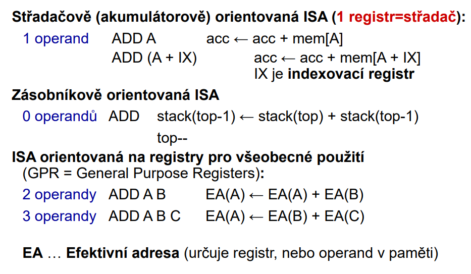
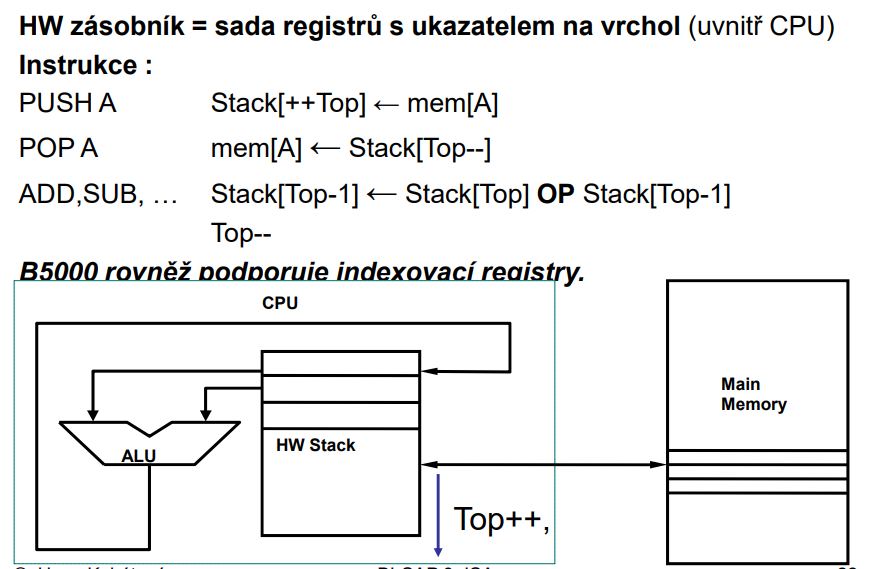

# 26. - Základní architektury počítačů
>Základní architektury počítačů, architektury mikroprocesorů, architektury signálových a grafických procesorů, architektury mikrořadičů, hodnocení výkonnosti počítačů, Amdahlův zákon, výkonnostní rovnice procesoru, srovnání systémů CISC a RISC.

## Základní pojmy
**Procesorem** se rozumí základní jednotka počítače, tj. logický automat pro zpracování informací, obsahující aritmetickou jednotku a řadič (počítač bez periferních zařízení a bez hlavní paměti), chování je definováno programem.

**Mikroprocesor** je malý procesor vyráběný technologií velké integrace, určen především na výpočty a logické funkce, je přednostně orientován na operace nad slovy. Mikroprocesor nemůže samostatně pracovat, protože ke své funkci potřebuje další periferie, které nejsou součástí mikroprocesoru (např. paměť). Označení mikroprocesor se používá pro integrovaný obvod, jehož součástí může být i více CPU.

**Mikrořadič** (microcontroller, monolitický mikropočítač, jednočipový mikropočítač) je mikropočítač v jednom integrovaném obvodu, ve kterém je integrovaná i RAM, ROM a případně další perifirie. Většinou k němu stačí připojit krystalový rezonátor, napájení, vstupní a výstupní zařízení a samozřejmě vložit program, podle něhož bude pracovat. 

## Architektury počítačů
*Architektura počítačů je metoda vytváření počítačových systémů z menších celků.*

Architektura je globální pohled na všechny podstatné vlastnosti počítačů, zahrnuje:

- **strukturu** – popis propojení jednotlivých funkčních bloků
- **organizaci** – popis dynamických interakcí FB a řízení styku mezi nimi
- **realizaci** – popis návrhu a vnitřní struktury jednotlivých FB
- **funkci** – popis chování počítače jako celku

Procesor (**CPU**) tvoří:

- **ALU** (Arithmetical and Logical Unit) – aritmeticko-logická jednotka
- **CU** (Control / Central Unit) – řadič, řídicí jednotka

Počítač tvoří:

- CPU
- paměť
- vstupy/výstupy

### Von Neumanova koncepce
Charakteristické vlastnosti lze shrnout do následujících bodů:

1. struktura počítače je nezávislá na typu řešené úlohy, počítač se programuje obsahem paměti
2. **instrukce a operandy jsou v téže paměti**
3. paměť je rozdělena do buněk stejné velikosti, jejich pořadová čísla se používají jako adresy
4. program je tvořen posloupností elementárních příkazů (instrukcí), které se provádějí jednotlivě v pořadí, v němž jsou zapsány do paměti
5. změna pořadí provádění instrukcí se vyvolá instrukcí podmíněného nebo nepodmíněného skoku
6. pro reprezentaci instrukcí i čísel se používají dvojkové signály a dvojková číselná soustava
7. programem řízené zpracování dat probíhá v počítači samočinně (tok dat řídí řadič)
8. **zpracování dat probíhá v tzv. diskrétním režimu (během výpočtu nelze s počítačem komunikovat)**
9. **vstupy (resp. výstupy) jsou koncipovány jako datové zdroje (resp. výsledky) a jsou tedy přímo napojeny na ALU.**

**Nevýhodou je možnost mylně interpretovat data jako program.**

*Von Neumannova koncepce*

### Harvardská koncepce
Základní principy (rozdíly vůči von Neumannově archit.):

1. **paměť programu je oddělena od paměti dat - možnost ve stejném okamžiku načítat instrukci a přistupovat k datové paměti - datová a programová paměť mohou mít odlišnou organizaci**
2. **oddělené sběrnice pro program a data**
3. **řízení procesoru je odděleno od řízení vstupních a výstupních jednotek (nejsou napojeny přímo na ALU)**

**Možnost rychlejšího zpracování většího objemu dat.**

*Harvardská koncepce*

*Rychlé moderní procesory spojují obě architektury. Uvnitř procesoru je použita Harvardská architektura, kde se paměť cache dělí na paměť instrukcí a paměť pro data. Ovšem celý procesor se „z venku“ chová jako procesor s architekturou von Neumannovou, protože načítá data i program z hlavní paměti na jednou.*

## Architektura procesoru
**Procesor se skládá z:**

- **řídicí jednotky** CU (Control Unit) – řadič
- **aritmeticko-logické jednotky** ALU (Arithmetic Logic Unit)
- **sady registrů** RS (Register Set), které uchovávají různé hodnoty během práce počítače (zápisníková paměť)
- **programového čítače** PC (Program Counter) – často se uvádí jako jeden registr RS nebo součást řadiče
- **vnitřní sběrnice** - řeší spojení mezi bloky CPU (typy - datová, adresová, řídicí), od každého typu může být v architektuře i více sběrnic

*Model Procesoru*

**Rozlišujeme 2 koncepce řadičů:**

- řadič je speciální sekvenční automat, který má čítač a dekodér (je dražší, ale rychlejší) – obvodový řadič (založen na kombinačních logických obvodech)
- dekódování operačního znaku vykonává řídicí paměť, ve které jsou mikroprogramy uloženy – mikroprogramový řadič (založen na výběru z paměti ROM).

**Kategorie procesorů:**

- Univerzální (Intel, AMD, …)
- Grafické (Nvidia, ATI, …)
- Signálové (TI, AD, …)
- Aplikační (pro mobilní telefony, …)
- Multimediální (TI, Mpact, …)
- Speciální (šifrovací, kompresní, hrací, …)

**Architektura souboru instrukcí** (ISA)

Souhrn vlastností počítačového systému viděného z pohledu programátora v strojovém jazyce (koncept struktury, funkčního chování)

*Skládá se z:*

- seznamu instrukcí procesoru
- datových typů
- dostupných režimů, jež jsou k dispozici
- seznamu registrů
- pravidel pro manipulaci s výjimkami a přerušeními

*Umožňuje*
- Abstrakce (výhoda – různé implementace stejné architektury)
- Definice rozhraní mezi nízko-úrovňovým SW a HW
- Standardizuje instrukce, bitové vzory strojového jazyka

*Dělíma na:*

- **Střadačově orientovaná ISA** 
  - nelze pracovat s registry napřímo, a je nutné si operadny vždy "zkopírovat" do střadače (akumulátoru)
  - Střadač je základní registr aritmetickologické jednotky, který vždy obsahuje jeden operand aritmetické nebo logické operace a do něhož se ukládá výsledek této operace. Protože registr dovoluje ve spolupráci s aritmetickologickou jednotkou postupné přičítání zpracovávaných čísel, nazývá se střadač nebo akumulátor. Zvláštností střadače u procesoru 8051 je to, že leží v paměťovém prostoru SFR vnitřní paměti RAM procesoru a je přístupný nejen běžnými instrukcemi, ale i pomocí přímé adresy označované v mnemonice procesoru symbolickým názvem ACC.
  - (dominantní střadač)
- **Zásobníkově orientovaná ISA**
  - (vše se děje přes zásobník [java bytecode procesory])
  - 
- **ISA s univerzálními registry** 
  - (nejpoužívanější architektura, mnoho univerzálních registrů)
  - Registry jsou rychlejší než paměť (včetně cache !!)
  - K registrům lze přistupovat náhodně (versus .. zásobník je přísně sekvenční)
  - Registry mohou obsahovat mezivýsledky a lokální proměnné
  - Méně častý přístup do paměti – potenciální urychlování
  - **Po roce 1975 používají všechny nové procesory nějakou podobu GPR (registry pro všeobecné použití)**

*Instrukční cyklus:*

- načtení instrukce (instruction fetch)
- dekódování (instruction decode)
- načtení operandů (operand fetch)
- vykonání operace (execution)
- obsluha paměti (memory)
- zápis výsledku (write back)

**Vývoj procesorů lze rozdělit do několika fází:**

- **Subskalární procesory** (Tradiční sekvenční provádění instrukcí.)
- **Skalární procesory** 
  - (Sekvenční zpracování částečně nahrazeno zpracováním paralelním (např. zřetězené zpracování, či něklok jednotek), v každý okamžik se dokončí jen jedna instrukce.)
  - Scalar processors represent a class of computer processors. A scalar processor processes only one data item at a time, with typical data items being integers or floating point numbers.[1] A scalar processor is classified as a SISD processor (Single Instructions, Single Data) in Flynn's taxonomy.
- **Superskalární procesory** 
  - Superskalární architektura (superskalarita) je v informatice jedním ze způsobů zvyšování výkonu procesoru. Superskalarita umožňuje v jednom taktu zpracovat více strojových instrukcí zároveň, protože některé části procesoru jsou duplikovány, například matematický koprocesor (FPU) nebo aritmeticko-logická jednotka (ALU). Od vícejádrových procesorů se superskalarita liší tím, že je zvětšen počet pouze některých částí procesoru.
  - (Umí dokončit více instrukcí za jeden cyklus.)

**Procesory dělíme podle instrukční sady na:**

**CISC**

Complex Instruction Set Computer. Rozsáhlý instrukční soubor, obsahuje i mnoho složitých instrukcí používaných jen zřídka.

- proměnná délka instrukcí
- zpracování instrukcí ve více strojových cyklech (CPI ~ 5-10)
- velký počet adresovacích módů
- díky vysoké složitosti byl řadič navržen na principu paměti s mikroprogramy (ROM)
- řídicí obvody zabírají na čipu přibližně 60% místa
- pro překlad programů bývá zpravidla jednodušší překladač
- s postupem doby se začíná používat zřetězené zpracování (zejména s rozkladem na mikroinstrukce)

**RISC**

Reduced Instruction Set Computer, (použit poprvé 1974) počátkem 80.let první RISC procesory. Snaha přesunout některé složité a zřídka používané CISC instrukce z mikroprogramů do programů (zvětšení počtu instrukcí v programu, ale snížení CPI).

- malý počet relativně jednoduchých instrukcí (důležitý není až tak počet, ale jednoduchost) (asi 40–150)
- jednoduché instrukce umožňují vyšší frekvenci
- implementováno proudové zpracování instrukcí - v každém taktu se většinou dokončí jedna instrukce (CPI < 1,5)
- instrukce mají většinou pevnou délku a malý počet formátů,
- řadič s pevnou logikou místo mikroprogramování (rychlé)
- řídicí obvody zabírají pouze 6–10 % místa (obvodový řadič)
- velký počet programově dostupných registrů (32–192)
- operace s daty pouze nad registry (2 zdrojové, 1 cílový)
- registry jsou víceúčelové (jednodušší překladače)
- malý počet adresových módů (3–5)
- nejčastěji harvardská architektura

**PostRISC (CRISC)**

*Do této kategorie je možné zařadit většinu současných CPU*

- kombinace CISC a RISC (navenek CISCové, ale vnitřní konstrukci mají RISCovou)
- instrukce trvají různě dlouhou dobu
- instrukce se rozloží na jednoduché mikroinstrukce
- proudové zpracování mikroinstrukcí
- větší množství paralelních operací
- spekulativní provádění instrukcí
- nadále dochází k dalšímu rozšiřování instrukční sady, zaměřené hlavně do multimediální oblasti a grafiky
- většinou se zachovává zpětná kompatibilita

**Praktický rozdíl mezi CRISC a RISC**

Procesory od Intel, AMD jsou CRISC, zatímco ARM (v mobilních zařízeních) jsou RISC. Díky jednoduchosti RISC architektury (řídících obvodů na procesoru) je možné dosáhnout mnohem menší spotřeby než u CRISC.

## Architektura signálových procesorů
Digitální signálový procesor nebo také digitální signální procesor (zkratka **DSP**) je mikroprocesor, jehož návrh je optimalizován pro algoritmy používané při zpracování digitálně reprezentovaných signálů. Hlavním nárokem na systém bývá průběžné zpracování velkého množství dat „protékajících“ procesorem. Často slouží jako hardwarová implementace různých číslicových filtrů.

**Hlavní součásti:**

- *Hlavní aritmetická jednotka* (jednotlivé části nezávislé):
 - jednotka MAC (Multiplier and Accumulator) – paralelní násobička a sčítačka (na 1 strojový cyklus) – velikost střadače dána součtem velikostí operandů + 8 bitů
 - jednotka ALU
 - jednotka podporující paralelní posuny (barell-shifter).
- *Generátory adres DAG* (Data Address Generator) - správa adres pro čtená data a konstanty, nejčastěji dva (pro konstanty a pro data) – podporují různé druhy adresování (inkrementace, dekrementace, reverzně bitové adresování, adresování v kruhovém zásobníku apod.).
- *Čítač instrukcí* – může opakovat jednu či více instrukcí.

DSP má většinou (**super)harvardskou architekturu** (zejména proto, že kód i data mají zvláštní sběrnice, možnost uchovávat data i v paměti programu).
Z pohledu instrukčního cyklu jsou architektury založeny většinou na vnitřním paralelismu (**superskalární**, speciální typy LIM a VLIM), někdy se využívají architektury paralelních systémů, příp. shlukování DSP do výpoč. sítí.

**Hlavní učelem je co nejrychleji zpracovat velké množství dat ideálné paralelně. (rychlá sčítačka a násobička, zdvojení výpočetní jednotek dle SIMD, zřetězení instrukcí, atd)**

*Typické blokové schéma dsp*

**Nejčastější algoritmy číslicového zpracování signálů:**

- konvoluce
- číslicová filtrace IIR, - diskrétní transformace
- korelace
- práce s maticemi

## Architektura grafických procesorů
**GPU** (graphic processing unit) je v informačních technologiích specializovaný mikroprocesor uvnitř počítače, telefonu a podobně. GPU zajišťuje rychlé grafické výpočty a změny obsahu videopaměti, které jsou posléze zobrazovány na monitoru. Moderní grafické procesory mohou být využívány i k jiným výpočtům, než pro zobrazování dat (například kryptoanalýza).

- podobnost s DSP (více univerzální)
    - DSP spíše audio hw realizovaný filtr v mp3 přehrávači
    - GPU univerzální pomocník procesoru na paralení výpočty (SIMD)
- velmi vysoký výkon na paralelní výpočty
- masivní paralelizace (používá se ke kryptoanylýze například pro lámání hashe)
- specializovaná architektura na vektorové a maticové operace (filtry, konvoluce, transformace)
- GPU obvykle disponují paměťovou sbernicí s mnohem vyšší propustností, než CPU. GPU totiž pracuje s větším množstvím dat najednou.

## Architektura mikrořadičů
Mikrořadič je jednoobvodový (jednočipový, monolitický) μP (mikroprocesor doplněný paměťmi a periferiemi). Vyznačují se velkou spolehlivostí a kompaktností, proto jsou určeny především pro jednoúčelové aplikace do vestavěných systémů.

*Blokové schéma mikrořadiče*

- RISC architektura (převážně jednocyklové instrukce, vyšší taktovací frekvence - např. 12 až 40 MHz)
- omezený soubor instrukcí (35–130)
- datová sběrnice relativně malá (8, 16, max. 32 bitů)
- relativně nízká cena (cca od 40,- Kč)
- široký rozsah napájecího napětí (od 2.7 V do 6 V)
- vstupy a výstupy organizovány do bran (nutno nastavit jako vstupní nebo výstupní)
- integrované speciální obvody (PWM, ADC či DAC převodníky, komparátory, komunikační sběrnice, radiče displeje atd.)

## Hodnocení výkonu
Základní požadavek kladený na počítač je schopnost provádět zpracování informací. Tuto schopnost označujeme jako výkonnost počítače. Výkonnost je obtížné hodnotit jediným číslem – objektivnější je použít tzv. vektor výkonnosti, jehož struktura se vyvíjí. Základem bývá počet operací (příp. instrukcí) za sekundu, buď v pevné nebo pohyblivé řádové čárce. Dalšími složkami mohou být propustnost systému, doba odezvy, stupeň využití, aj. Hodnocení výkonnosti by mělo být podkladem pro optimalizaci.

**Metriky výkonosti**

- **MIPS** (Million Instructions Per Second)
- **MOPS** (Million Operations Per Second)
- **MFLOPS** (Million FLoating point Operations Per Second)

- Jedna instrukce může mít zejména na CISC více operací.

### Výkonostní rovnice

**Výkonnost CPU závisí na:**

- počtu instrukcí (IC – Instruction Count)
- (průměrném) počtu taktů na instrukci (CPI – Cycles Per Instruction)
- periodě hodinového signálu (Tclk) – doba cyklu (taktu)

*Doba provádění programu TCPU je dána počtem hod. cyklů během programu násobená dobou cyklu Tclk (je-li konst.)*

*Výkonostní rovnice*

**Příklad**

Počítač zpracovává program, který má 5 miliónů 1-CPI (jednotaktových instrukcí), 1 milión 2-CPI a 1 milión 3-CPI. Kmitočet hodinových taktů je 100 MHz. Jaká je jeho výkonnost v MIPS?

### Amhdahlův zákon
Amdahlův zákon je pravidlo používané v informatice k vyjádření maximálního předpokládaného zlepšení systému poté, co je vylepšena pouze některá z jeho částí. Využívá se např. u víceprocesorových systémů k předpovězení teoretického maximálního zrychlení při přidávání dalších procesorů.

- Úloh, které vyžadují čistě paralelní zpracování, je poměrně málo.
- V praxi jsou nejčastější úlohy, v nichž se střídají úseky výpočtu, který je nutno provádět sekvenčně s úseky vhodnými pro paralelní zpracování.
- Při posuzování účinku paralelizace na výkon systému lze použít analytický vztah, který je podle svého autora Gene Amdahla nazýván zákonem Amdahlovým.
- Předpokládejme, že určitý výpočet lze částečně paralelizovat. To znamená, že kromě části , kterou je nutno provést sériově na jednom procesoru (obvykle vstup a výstup dat, případně jejich předzpracování), lze zbytek výpočtu zadat několika procesorům, tak aby zpracování na nich probíhalo současně.

**Nevýhody**

- Zákon byl formulován v roce 1967
- Má své nedostatky plynoucí hlavně z doby, kdy vzniknul.
- Zákon řeší pouze problém o konstantní velikosti.
- Jinými slovy, paralelní část je fixní.
- S rostoucím počtem procesorů se nemění rozsah problému.
- Nezvažuje vůbec dostupnost výpočetní síly

*Amdáhlův zákon*

**Zrychlení S** je číslo, které udává kolikrát je rychlejší běh úlohy na počítači s vylepšením oproti běhu stejné úlohy na původním počítači.

 .... udává, jakou část výpočtu lze vylepšit

 .... udává, kolikrát se zrychlil výpočet zlepšené části úlohy

**Příklad**

Předpokládejme, že výpočet trvá 30 % času, zbytek času je nevyužit či se čeká na I/O. Dále předpokládejme, že výpočet můžeme 5× zrychlit. Jaká bude celková hodnota zrychlení?

Z výpočtu je vidět, že systém bude zrychlen přibližně o 31,6 %.

**Paralelní systém**

Celkové zrychlení výpočtu multiprocesorového systému, který má **p** procesorů, a jehož část programu **fs** může být provedena pouze jediným procesorem (sériová, neparalelizovatelná část), resp. je-li **fp** poměr paralelizovatelné části výpočtu, je dáno:

*Zrychlení multiprocesorového systému*

**Příklad paralelní systém**

Jak se zrychlí výpočet dvouprocesorového systému, jestliže 80 % výpočetního algoritmu lze paralelizovat?

