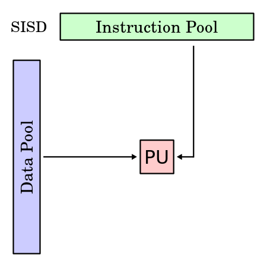
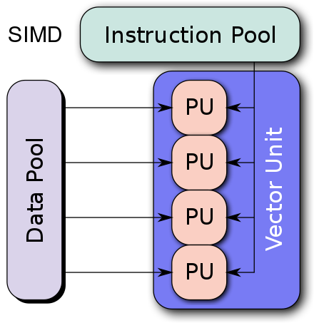
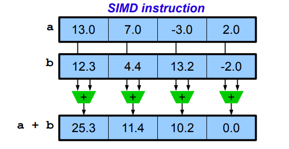
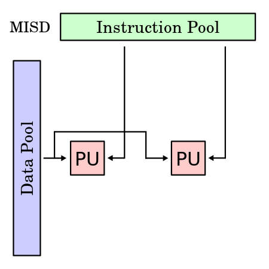
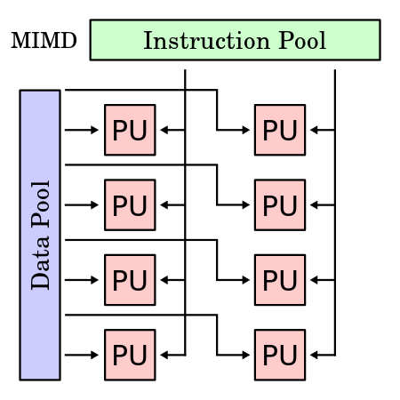

# 27\. - Paralelní systémy

> Paralelní systémy, kategorie, paralelizace zpracování, víceprocesorové systémy, programování v paralelních a distribuovaných systémech – přístupy, prostředky, metody vzájemné synchronizace.

## Základní pojmy

**Paralelismus** - Vytváření souběžnosti, zdánlivý nebo skutečný paralelní běh více procesů zároveň.

- **Skutečný** (_paralelismus_) - Každý proces má svůj vlastní procesor, v praxi téměř nemožné.
- **Zdánlivý** (_pseudoparalelismus_) - Několik procesů se navzájem dělí o časové kvantum na jednom CPU, takto funguje drtivá většina moderních systémů.

**Multitasking** - Schopnost operačního systému provádět (přinejmenším zdánlivě) několik procesů současně.

**Program** - Realizace algoritmu v programovacím jazyce, pro interpretované jazyky je vyskytuje ve formě spustitelného skryptu a pro kompilované jazyky jako spustitelný binární soubor.

**Proces** - Spuštěný program, který OS zavedl do operační paměti a přidělil mu určitá práva a vyhrazenou pamět.

**Vlákno** - Při vytvoření nového procesu je automaticky vždy vytvořeno primární vlákno. Vlákno je objektem OS, ve kterém běží samotný programový kód. Všechny vlákna v rámci procesu sdílí tentýž virtuální adresní prostor.

> V rámci jednoho **procesu** může běžet několik **vláken**, ty mají sdílenou pamět a při jejich střídání nemusí docházet ke změně kontextu. Díky tomu je mezi vláknová komunikace jednoduší a střídání vláken je rychlejší. Použití oddělených procesu se používá například z bezpečnostních důvodů k omezení přístupu do sdílené paměti.

## Vlákna

### Podpora v OS

Vlákna můžeme dělit z hlediska správy v OS:

- **Vlákna na uživatelské úrovni** (_ULT_)

  - správu vláken provádí vláknová knihovna (vytváří a ruší vlákna, plánuje běh vlákna, předává data a zprávy mezi vlákny, uchovává a obnovuje kontext vláken)
  - není potřeba OS
  - přepínání mezi vlákny je nezávislé na OS
  - vytvoření nepotřebuje náročné systémové volání
  - nemohou běžet paralelně
  - priority vláken se uplatňují jen v rámci času procesu

- **Vlákna na úrovni jádra** (_KLT_)

  - správa vláken provádí OS
  - každé vlákno v uživatelském prostoru je zobrazeno na vlákno v jádře.
  - Samotné jádro vytváří, ruší a plánuje vlákna.
  - vlákna mohou běžet paralelně
  - volání systému neblokuje ostatní vlákna téhož procesu
  - jeden proces může využít více procesorů
  - tvorba, rušení a přepínání mezi vlákny je levnější než mezi procesy
  - vytvoření vlákna je časově náročnější

- **Kombinace** (_ULT_ a _KLT_)

### Modely vícevláknových aplikací

Modely řešící způsob jak vytvářit a rozdělit práci mezi vlákny

- **Boss/Worker**

  - hlavní vlákno řídí rozdělení úlohy jiným vláknům
  - hlavní vlákno je zodpovědné za vyřizování požadavků
  - pracuje v cyklu: přijde požadavek - vytvoří se vlákno pro řešení příslušného úkolu - čeká se, až se požadavek vrátí
  - jednotlivé Workers nemusí vědět o vstupu, ale musí o něm vědět Boss, který pak rozděluje úlohy

- **Peer**

  - vlákna běží paralelně bez specifického vedoucího
  - neobsahuje hlavní vlákno
  - všechny vlákna jsou si rovny
  - vlákno je zodpovědné za svůj vstup a výstup
  - všechny 3 Workery si sahají na vstup pro data

- **Pipeline**

  - zpracování dat sekvencí operací.
  - dlouhý vstupní proud dat
  - sekvence operací, každá vstupní jednotka musí projít všemi částmi zpracování
  - jednotky jsou nezávislé
  - o vstupu ví jen první, udělí se část dat a předá dál

- **Producent a konzument**

  - předávání dat mezi vlákny je realizováno vyrovnávací pamětí (buffer)
  - _producent_ - vlákno, které předává data jinému vláknu
  - _konzument_ - vlákno, které přijímá data od jiného vlákna
  - přístup do vyrovnávací paměti musí být synchronizovaný (exkluzivní přístup)

## Paralelní systémy

Jako paralelní označujeme systém, v němž může probíhat několik procesů současně (paralelně).

- snaha zvyšovat výkonnost nad hranici danou technologií výroby součástek (mikroprocesorů)
- rozměry, cena a energetická náročnost elektronických prvků klesá rychleji než roste jejich rychlost
- výkonnost většinou neroste lineárně s počtem procesorů (má spíše logaritmický průběh) - vlivem komunikace CPU, synchronizace, nedokonalým vytížením, nevhodnými algoritmy apod.
- od jisté hranice je přidávání procesorů nerentabilní viz [okruh 26](https://github.com/tomaskrizek/tul-szz-it-nv/blob/master/26_zakladni_architektury_pocitacu/26_zakladni_architektury_pocitacu.md), Amhdalův zákon.

**Superpočítač** - Jednolitý počítač, kde jsou komponenty úzce propojeny a komunikují po interní sběrnici a sdílejí pamět. Lze si představit jako velkou základní desku s mnoha sloty. Obrovský výpočetní výkon, ale zároveň i velká počáteční investice a složité možnosti rozšiřování.

**Cluster** - Sada nezávislých počítačů propojených rychlou sítí. Obvykle se vyskytují společně v jedné serverovně a mají stejný operační systém s nadstavbu pro společnou komunikaci. Snadné rozšiřování pouhým přidáváním dalších uzlů.

**Grid** - Podobné jako cluster, ale počítače jsou rozmístěny v internetu a nemusí mít stejný operační systém. Propojení je řešeno přes speciálních aplikací (middleware). Po spuštění aplikace se stáhne sada výpočtů, které počítač provádí a výsledek je odesílán zpět. Viz různé vědecké projekty na hromadné zkoumání genomu či vesmíru. Případně může jít o spojení několika clusterů, kvůli snadné správě a sdílení výpočetního výkonu.

### Architektura

Rozlišujeme 2 druhy architektur:

1. **Paralelní počítače (multiprocesory) se sdílenou pamětí** (superpočítač)

  - Procesory mohou sdílet paměť (RAM) jednoho počítače
  - U symetrických multiprocesorů může běžet kterýkoliv proces na kterémkoliv procesoru, procesory jsou univerzální
  - U asymetrických multiprocesorů je každý procesor specializován na určitý úkol
  - procesory se mohou synchronizovat, ale problém exkluzivity přístupu do paměti

2. **Paralelní počítače(multiprocesory) s distribuovanou pamětí** (cluster)

  - je to více strojů spojených dohromady pomocí komunikační sítě
  - Procesory spolu komunikují zasíláním zpráv
  - masivně paralelní počítače a clustery
  - není problém s exkluzivitou přístupu, ale komunikační problém

### Flynova klasifikace

Podle toku instrukcí:

- **SI** (_Single Instruction Stream_) s jedním tokem instrukcí
- **MI** (_Multilple Instruction Stream_) s vícenásobným tokem instrukcí

Podle toku dat:

- **SD** (_Single Data Stream_) s jedním tokem dat
- **MD** (_Multilple Data Stream_) s vícenásobným tokem dat

Kategorie:

- **SISD** 
  - Počítač zpracovává data sériově podle jednoho programu (Von Neuman)
  - Is a computer architecture in which a single uni-core processor, executes a single instruction stream, to operate on data stored in a single memory.
  - 
- **SIMD** 
  - Počítač používající větší množství stejných procesorů řízených společným programem (vektorové počítače). Procesory provádějí stejnou instrukci, ale s jinými daty.
  - It describes computers with multiple processing elements that perform the same operation on multiple data points simultaneously. 
  - 
  - 
- **MISD**
  - Není běžné, vznikla uměle. Série procesorů, které postupně zpracovávají společná data.
  - Is a type of parallel computing architecture where many functional units perform different operations on the same data
  - 
- **MIMD**
  - Multiprocesorový systém, každý procesor je řízen samostatným programem pracujícím na samostatných datech.
  - At any time, different processors may be executing different instructions on different pieces of data.
  - 

## Paralelizace

### Druhy paralelismu

- **Funkční paralelismus**

  - Složitá činnost (popsaná nějakou funkcí) se rozdělí na více jednodušších, dílčích činností.
  - Každou z těchto dílčích činností vykonává jedno vlákno (proces).
  - Pro složité úlohy nad jednoduchými daty.
  - Analogie se životem: při stavbě rodinného domku se zároveň zavádí elektřina i plyn.
  - Má smysl i na jednoprocesorových počítačích.

- **Datový paralelismus**

  - Používá se v případě relativně jednoduché činnosti nad rozsáhlými daty.
  - Data se rozdělí „na kousky" a nad každým kouskem dat provede jedno vlákno tutéž činnost.
  - Analogie se životem: dlouhý výkop hloubí parta kopáčů, každý je zodpovědný za jeden úsek výkopu.
  - Prakticky nemá smysl provozovat na jednoprocesorovém stroji.

- **Zřetězené zpracování dat**

  - Vlákna (procesy) si „předávají" nějaký datový záznam.
  - Každé s ním udělá nějaký „kus práce" a předá jej dál.
  - V tom okamžiku je již připraveno opět přijmout další záznam.

## Programovací prostředky pro paralelizaci

- **Jazyk s explicitní podporou paralelismu** (paralelismus je přímou součástí jazyka)

  - Podpora paralelismu na úrovních příkazů, procedur a procesů.
  - Typickým představitelem je ADA a High Performance Fortran.

- **Použití speciálních paralelizačních kompilátorů**

  - Možnost použití univerzálního jazyka (např. C nebo Fortran).
  - Kompilátor automaticky detekuje možnou souběžnost kódu v sekvenčním algoritmu.
  - Umožňuje „bezpracný" převod na paralelní zpracování - řešení není vždy přímočaré.

- **Použití speciálních paralelizačních knihoven**

  - Možnost použití univerzálního jazyka a běžného kompilátoru (výhoda).
  - Paralelizace je realizována pomocí speciálních knihoven externích funkcí a objektů.
  - Nejčastěji jsou používány knihovny PVM (Parallel Virtual Machine) či MPI (Message Passing Interface).
  - Typickými jazyky jsou C, C++, Fortran, Java (balíčky JPVM a mpiJava).
  
### PVM (Parallel Virtual Machine)
- distribuovaná pamět
- heterogenní clustery (můžou být obyčejné počítače připojeny na obyčejnou síť)
- funguje na principu předávání zpráv
- na každém počítači musí běžet démon
- pro komunikaci s uzly slouží knihovna PVM poskytující rozhraní pro paralelní operace (jazyk C, C++, Fortran)
- Parallel Virtual Machine (PVM) is a software tool for parallel networking of computers. It is designed to allow a network of heterogeneous Unix and/or Windows machines to be used as a single distributed parallel processor. Thus large computational problems can be solved more cost effectively by using the aggregate power and memory of many computers. The software is very portable; the source code, available free through netlib, has been compiled on everything from laptops to Crays
- [Wikipedia](https://en.wikipedia.org/wiki/Parallel_Virtual_Machine)

### MPI (Message Passing Interface)
- distribuovaná pamět
- homogenní clustery
- MPI aplikace můž být spuštěna ve dvou módech:
    - **Multicore mode** - mod použitý na vícejádrových počítačích
    - **Cluster mode** - mod určený pro clustery homogenních počítačů
- procesy se shlukují do do skupin (tzv. komunikátorů)
- pro komunikaci jsou k dispozici 2 mechanismy:
    - Message passing
    - Remote memory access
- Typpy komunikace:
    - point to point
        - blokující (sychronní)
        - neblokující (asynchronní)
    - kolektivní komunikace (cílem je více procesů)
        - Synchronizace (každý komunikátor realizuje tzv. bariéru, na které je možné všechny procesy synchronizovat)
        - Přesuny dat (rozselání dat všem procesům)
        - Redukční operace (Redukce dat všech procesů na jednu hodnotu - MAX, MIN, SUM, AVG atd.)
 - MPI is a communication protocol for programming parallel computers. Both point-to-point and collective communication are supported. MPI "is a message-passing application programmer interface, together with protocol and semantic specifications for how its features must behave in any implementation."
 - [Wikipedia](https://en.wikipedia.org/wiki/Message_Passing_Interface)

## Synchronizace
Synchronizační primitiva jsou v operačních systémech prostředky, umožňující zároveň běžícím aplikacím ošetřit současný přístup ke sdíleným prostředkům. Ve smyslu algoritmu se jedná o rozhraní a jeho implementace není důležitá. 
 - Deadlock - vlákno A čeká na dokončení vlákna B, které čeká na dokončení vlákna A 
 - Souběh - data jsou zároveň zapisována a čtena 

Mezi synchronizační primitiva patří zámek a jeho zobecnění - semafory, fronty zpráv a monitor. Zámky a semafory bývají implementovány operačním systémem pomocí atomických operací na sdílené paměti a plánovače. Pro synchronizaci v paralelním programování stačí atomické operace na sdílené paměti (čekají na sebe procesy na různých procesorech a tedy mohou čekat aktivně) a je možné je implementovat i bez pomoci operačního systému. Fronty zpráv jsou primitivní operací v případě paralelního programování, ale je možné je implementovat v operačním systému i na jednom procesoru. Monitor je možné realizovat pouze s podporou programovacího jazyka. 

 **K uváznutí dojde jen při splnění všech následujících podmínek:**
1. Vzájemné vyloučení (Mutual exclusion)
    - Prostředek může v jednom okamžiku používat jenom jeden proces (jinak dojde k chybě).
2. Drž a čekej (Hold & wait)
    - Proces může žádat o další prostředky, i když už má nějaké přiděleny.
3. Neodnímatelnost (No preemption)
    - Jakmile proces zmíněný prostředek vlastní, nelze mu ho bezpečně odejmout, musí ho sám vrátit.
4. Čekání do kruhu (Circular wait)
    - Je možné uzavřít cyklus z procesů čekající každý na svého předchůdce – respektive k deadlocku dojde, jakmile je tento cyklus uzavřen. 

### Časově závislé chyby
- Dva nebo několik procesů používá (čte/zapisuje) společné sdílené prostředky (např. sdílená
paměť, sdílení proměnné, sdílené soubory,…).
- Výsledek výpočtu je závislý na přepínání kontextu jednotlivých procesů, které používají sdílené
prostředky.
- Velmi špatně se detekují (náhodný výskyt)

### Kritická sekce
- část programu, kde procesy používají sdílené prostředky (např. sdílená paměť, sdílená proměnná,
sdílený soubor, ...).
- Sdružené kritické sekce = kritické sekce dvou (nebo více) procesů, které se týkají stejného
sdíleného prostředku
- **MUTEX**
  - Nejprve si položme otázku, co je to kritická sekce. Za kritickou sekci považujeme tu část kódu vlákna, která operuje nad sdílenými daty a hrozí, že paralelně může jiné vlákno operovat nad stejnými daty. Důsledkem může být nekonzistence dat. Například jedno vlákno zvýší sdílenou proměnnou A o jedna a dále s ní počítá, kdežto druhé vlákno proměnou A zmenší o dvě a dále s ní počítá. Pokud se poštěstí, tak se instrukce mohou proložit tak, že ani jedno vlákno nedá správný výsledek. Tomuto je třeba zabránit a to tím, že do té části, která pracuje s proměnnou A může vstoupit pouze jedno vlákno, druhé musí čekat až to první skončí.Takovéto kritické sekce, kde může být v jednom okamžiku pouze jedno vlákno, nazýváme MUTEX (MUTual EXclusion)
  - **stavy**
    - locked
    - unlocked
  - U mutexů se můžeme setkat s tím, že bude třeba mutex zamknout v závislosti na podmínce. Například problém producent - konzument.
Producent produkuje data do sdílené proměnné a konzument je čte. Přitom proměnná musí být zabezpečena mutexem a zároveň se musí hlídat stav, zda proměnná obsahuje užitečná data.
  - "Štafetový kolík" - kdo ho má, může přistupovat k jemu příslušnému zdroji
  - [Wikipedia](https://cs.wikipedia.org/wiki/Vz%C3%A1jemn%C3%A9_vylou%C4%8Den%C3%AD)
- **Semafor** 
  - Semafor je synchronizační primitivum obsahující celočíselný čítač, který si lze představit například jako počítadlo volných prostředků. Poskytuje atomické operace „up“ a „down“. Operace „down“ sníží čítač o jedničku, v případě, že už je nulový (nedostává se prostředků), se proces zablokuje a přidá do fronty procesů čekajících na daný semafor. Operace „up“ zkontroluje frontu, a v případě, že je neprázdná, vybere jeden proces čekající ve frontě a odblokuje jej (ten pak pokračuje za svou operací „down“); je-li fronta prázdná, zvýší hodnotu čítače o jedničku
  - Názvy operací P a V jsou tradiční a pochází od Edsgera Dijkstry, který semafory vymyslel. Jsou odvozeny od holandských slov „prolaag“ (složeno z probeer te verlagen, zkus a sniž) a „verhoog“, zvyš
  - Semafory se používají pro podobný účel jako mutexy, a to pro kontrolování vstupu do kritických sekcí. Ale na rozdíl od mutexu, kdy v sekci může být pouze jeden, se semafory lze docílit, že v sekci může být více vláken. Semafor si můžeme představit jako počítadlo s počáteční hodnotou, kterou nastaví uživatel. Vždy při vstupu do kritické sekce se čeká, dokud není hodnota semaforu větší než nula. Pokud je, pak se hodnota zmenší o jednu a vstoupí se do kritické sekce. Na konci sekce se hodnota semaforu o jedničku zvedne.
  - Suppose a library has 10 identical study rooms, to be used by one student at a time. Students must request a room from the front desk if they wish to use a study room. If no rooms are free, students wait at the desk until someone relinquishes a room. When a student has finished using a room, the student must return to the desk and indicate that one room has become free.
  - [Wikipedia](https://cs.wikipedia.org/wiki/Semafor_(synchronizace))
- **Monitor** 
  - Monitor je synchronizační primitivum, které se používá pro řízení přístupu ke sdíleným prostředkům. Jeho zvláštností je, že jde o speciální konstrukci programovacího jazyka (musí ho tedy implementovat překladač). Výhodou monitoru oproti jiným primitivům je jeho vysokoúrovňovost – snadněji se používá a je bezpečnější. Při jeho použití je méně pravděpodobné, že programátor udělá chybu.
  - Monitor se skládá z dat, ke kterým je potřeba řídit přístup, a množiny funkcí, které nad těmito daty operují. Najdete ho například v Concurrent Pascalu, Module, Javě
  - Zřejmě nejjednodušší bude demonstrovat monitory právě na Javě. Ta má klíčové slovo synchronized, které lze uvést u metod objektu. Pokud je nějaká metoda takto označena, před jejím vykonáním se zamkne zámek spojený s jejím objektem, čímž je zajištěna synchronizace. Java nabízí také synchronizaci bloku kódu na explicitně uvedeném objektu, který v podstatě dovoluje označit v kódu kritické sekce.
  - Monitor se podobá třídě z OOP. Odlišností je to, že překladač doplní monitor o zámek, díky němuž se dosáhne vzájemného vyloučení – v jednu chvíli může být uvnitř monitoru jen jeden proces
  - Když chce proces vstoupit do monitoru (tj. zavolat jeho funkci), musí nejdříve získat zámek. Pokud zámek v tu chvíli drží někdo jiný, tak se proces zablokuje a čeká, dokud se zámek neuvolní (tj. dokud jiný proces neopustí monitor nebo nezačne čekat na podmíněnou proměnnou).
  - Celý proces zamykání je pro programátora transparentní. V programu se funkce monitoru volají stejně jako ostatní funkce. Kód, který provádí zamykání a odemykání, vygeneruje překladač.
  - [Wikipedia](https://cs.wikipedia.org/wiki/Monitor_(synchronizace))
